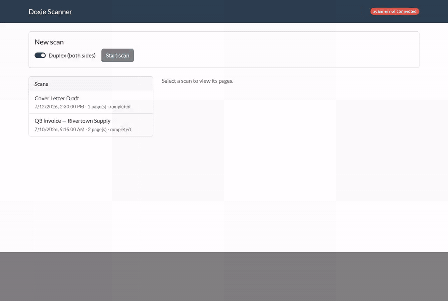

# Doxie Scanner

A standalone, linux focused, self-hosted web app for driving a **Doxie Pro DX400** document scanner. Talks to the scanner directly over raw SCSI-over-USB-bulk — no
SANE, no `scanimage`, no vendor drivers — with a simple web UI for
scanning, reviewing, rotating/cropping, and exporting pages as PNG, JPEG,
or PDF.

Ships as a single Docker image with the frontend baked into the binary.

**Linux only, and specifically the Doxie Pro DX400** — this isn't a
general Avision/Doxie driver. It talks to one exact device (USB VID:PID
`2740:000c`) via the raw USB device nodes under `/dev/bus/usb`, which is
a Linux-specific interface; it will not run on macOS or Windows, and it
will not recognize any other scanner, including other Doxie models.

> Not affiliated with, endorsed by, or sponsored by Doxie, Apparent Corp.,
> or Avision. "Doxie" and "Doxie Pro" are trademarks of their respective
> owners, referenced here only to describe hardware compatibility.



## How this was built

This driver implements the standard **SCSI-2 scanner command set**
(INQUIRY, SET WINDOW, READ, SEND, SCAN, RESERVE/RELEASE UNIT) that the
device speaks over plain USB bulk transfers — the same generic protocol
family SANE's `avision` backend uses, not any Doxie/Avision-proprietary
transport.

The exact byte sequences this hardware expects were captured from a
`usbmon` packet trace of a real scan and reimplemented from scratch
against that observed wire data — no vendor or SANE source code is
copied anywhere in this repository. A locally-patched build of SANE's
(GPL-2.0) `avision` backend was used once, purely as a diagnostic tool to
get this specific device talking to SANE long enough to capture its
traffic; that patched build was never distributed and isn't part of this
project. Reverse-engineering a protocol from observed traffic and
independently reimplementing it is the same well-established basis
projects like Samba, Wine, and ReactOS rely on — this repo contains only
that independent reimplementation, licensed under MIT (see LICENSE).

## Features

- Start single or multi-page (ADF) scans, simplex or duplex, from the browser
- "Start scan" is only enabled once the scanner is actually reachable — a
  live "connected / not connected" status badge backs it, no page refresh needed
- **Duplex scans number each side as its own independent page.** One
  duplex sheet followed by one simplex sheet produces 3 pages: 1 and 2
  are the duplex sheet's front and back, 3 is the simplex sheet — pages
  are numbered by image, not by physical sheet
- Automatic blank-back detection for duplex scans: a blank back simply
  doesn't become a page, rather than producing an empty one to delete later
- Click any page to open it in a full-size viewer with rotate (left/right
  90° — click repeatedly for 180°/270°), crop, export, delete, and OCR
  actions all in one place
- **Extract Text** runs OCR on a page and shows the result in a
  copy-pasteable box — automatically corrects a crooked scan first, since
  even a few degrees of skew measurably hurts recognition accuracy
- Drag and drop to reorder pages within a scan
- Export a single page as PNG, JPEG, or PDF; export a whole scan as one
  combined PDF with one click; or hand-pick pages from **any number of
  past scans**, in any order, into one combined PDF
- Auto-named scans ("Scan 2026-07-14 15:30"), renamable afterward, with
  the scan list showing creation date/time and page count so similarly
  named scans stay easy to tell apart
- The UI is available in English and Spanish, auto-detected from the
  browser with a manual override (navbar dropdown, remembered for next
  time)
- No authentication, no database — just a REST API and a folder of files

## Requirements

- Docker (or a Go 1.24+ toolchain with a C compiler and libusb-1.0 dev
  headers, if running outside Docker)
- A Doxie Pro DX400 scanner connected over USB
- **A persistent volume mounted at `/data`.** This is not optional: scan
  data lives only in this directory, and if it's not backed by a real
  bind mount, every scan is lost the moment the container is recreated.
  The app refuses to start if `/data` isn't writable, but it cannot
  detect "writable anonymous volume" vs. "real persistent bind mount" —
  that part is on you. Always use `-v <host-path>:/data`.

## Quick start

```bash
docker run -d \
  --name doxie-scanner \
  -p 8080:8080 \
  -v ./data:/data \
  -v /dev/bus/usb:/dev/bus/usb \
  --device-cgroup-rule='c 189:* rmw' \
  ghcr.io/andiapps-dev/doxie-scanner:latest
```

Or with Compose:

```bash
docker compose up -d
```

Then open `http://localhost:8080`.

### USB passthrough

**Use the `-v /dev/bus/usb:/dev/bus/usb` + `--device-cgroup-rule='c 189:* rmw'`
combo shown above, not plain `--device=/dev/bus/usb`.** This matters more
than it looks: Docker's `--device` flag walks the directory *once, at
container start* and writes a device-cgroup ACL rule for each specific
bus/device number it finds at that moment. Unplugging and replugging the
scanner gets it a *new* bus/device number — the container can still see
that file (the bind mount is live), but the ACL computed at startup never
covered it, so opening it fails with something like
`libusb: no device [code -4]` even though `lsusb` shows the scanner fine.
`189` is the USB device major number and `*` matches any minor, so the
cgroup rule above covers whatever bus/device number the kernel assigns,
including ones that show up after the container is already running — no
restart needed after a reconnect.

Note this cgroup rule can't be scoped tighter than "all USB devices" (major
189) while still surviving reconnects — cgroup device rules match kernel
device numbers, not USB vendor/product IDs, and the whole reason for the
wildcard is that the number changes on every reconnect. There's no way to
name just this one scanner at that level.

The provided `udev/99-doxie-scanner.rules` (installed on the **host**, not
in the container) is solving a different, unrelated problem: the
container image runs as root by default specifically so it doesn't need
that rule (root can open any device node regardless of its file
permissions). If you harden the container to run as a non-root user
instead, standard Unix file permissions on the device node (typically
`root:root`, mode 0664) become the second gate a non-root process must
also clear — that's what the udev rule's `MODE="0666"` is for. It doesn't
replace or narrow the cgroup rule above; the two operate at different
layers (cgroup ACL: can this container touch USB devices at all; file
permissions: can this specific UID open this specific node).

Either way, confirm the scanner shows up before troubleshooting the app:

```bash
lsusb -d 2740:000c
```

## Using the web UI

- **Scans list** (left panel): shows every scan with its creation
  date/time and page count, newest first. The selected scan is
  highlighted. Click a scan to view its pages.
- **Page grid**: one tile per page — a duplex sheet's front and back are
  two separate tiles, tiled to fill the available width before wrapping
  to the next row. Drag a tile to reorder it — page numbers/URLs don't
  change, only their position in the scan.
- **Page viewer**: click any page tile to open it full-size, with all
  editing actions (rotate, crop, export, delete) in one place. Cropping
  uses the already-loaded full-size image, so the crop tool never has to
  resize itself mid-edit. A spinner covers the screen while an action
  that round-trips through the server (rotate, crop, export, combine) is
  in flight.
- **Combine into PDF**: check "select for combine" on any pages (in the
  grid or the viewer) — across as many different scans as you like — and
  a bar at the bottom shows a thumbnail of every page you've picked so
  far. Drag those thumbnails to set the order the combined PDF comes out
  in, or click the × on one to drop it from the selection, all without
  leaving the bar. For a single scan, "Export scan as PDF" in its header
  does the same for every page in that scan in one click.

## Scripts

- `./build.sh [docker|local]` — build the Docker image (default) or a
  native binary at `./doxie-scanner`. Set `VERSION=v1.2.0` to bake a
  version into the build (see Releasing below); defaults to `dev`.
- `./test.sh` — `go vet` + `go build` + `go test` with the same coverage
  gate CI enforces (see Coverage below)
- `./run.sh` — run the locally-built image with the required data volume
  and USB passthrough already wired in

## API reference

All endpoints are JSON except where noted. No authentication.

| Method & path | Purpose |
|---|---|
| `GET /api/version` | `{"version": "..."}` — the git tag this build was released from, or `"dev"` for a local/untagged build. |
| `GET /api/scanner/status` | `{connected, vid, pid, driver, error?}` — always 200; "not connected" is a normal poll result, not an HTTP error. |
| `POST /api/scans` | `{"duplex": bool}` → starts a scan job. `202 {jobId, status}`. `409` if a scan is already running. |
| `GET /api/scans` | List jobs, newest first. |
| `GET /api/scans/{id}` | Full job detail + pages; while running, also includes live `pagesScanned` progress. |
| `PATCH /api/scans/{id}` | `{"name": "..."}` — rename a scan. |
| `DELETE /api/scans/{id}` | Delete a scan and all its pages. |
| `GET /api/scans/{id}/pages/{n}` | Raw page PNG. |
| `DELETE /api/scans/{id}/pages/{n}` | Delete one page. |
| `PATCH /api/scans/{id}/pages/order` | `{"order": [3,1,2]}` — reorders a scan's pages (a permutation of its existing page numbers). Page numbers, URLs, and filenames don't change — only their position. |
| `POST /api/scans/{id}/pages/{n}/rotate` | `{"degrees": 90\|180\|270}` — clockwise, in place. |
| `POST /api/scans/{id}/pages/{n}/crop` | `{"x","y","width","height"}` — in place. |
| `GET /api/scans/{id}/pages/{n}/export?format=png\|jpg\|pdf` | Single-page export, downloaded as an attachment. |
| `GET /api/scans/{id}/pages/{n}/ocr` | `{"text": "..."}` — runs OCR (with automatic deskew) and returns the recognized text. Not cached; regenerated on every call. |
| `POST /api/export/combine` | `{"pages":[{"jobId","page"}...], "title"}` — combines pages **from any scans** into one PDF, in the given order. |

Errors look like:

```json
{"error": {"code": "device_not_found", "message": "no USB device with VID 0x2740 PID 0x000c found — is it powered on and connected?"}}
```

| Code | Meaning |
|---|---|
| `device_not_found` | No matching USB device. Check power and cabling; confirm with `lsusb -d 2740:000c`. |
| `claim_interface_failed` | Device found, but its USB interface couldn't be claimed — usually a permissions issue (see USB passthrough above) or another process already has it open. |
| `scsi_error` | A SCSI command failed in a way that isn't a normal end-of-document condition. |
| `not_found` | The requested job or page doesn't exist. |
| `bad_request` | Malformed input (bad JSON, invalid page number, unsupported export format, etc). |

## Extending to other scanners

This app is built around a small `driver.Driver`/`driver.Session`
interface (`internal/driver`); nothing in job orchestration, storage, the
HTTP API, or the frontend knows about the Doxie DX400 specifically. A
second Avision-family scanner could reuse `internal/scsiusb` (the generic
USB-bulk + SCSI-CDB transport) unchanged and only needs its own protocol
constants and sense-code classification — see `internal/doxiedx400` for
the reference implementation. Select which driver runs via the
`DOXIE_DRIVER` environment variable (default `doxie-dx400`).

## Configuration

| Env var | Default | Purpose |
|---|---|---|
| `DOXIE_DATA_DIR` | `/data` | Where scan jobs are stored. Must be writable; see above. |
| `DOXIE_LISTEN_ADDR` | `:8080` | HTTP listen address. |
| `DOXIE_DRIVER` | `doxie-dx400` | Which registered driver to use. |
| `DOXIE_OCR_LANG` | `eng` | Tesseract language code "Extract Text" uses. Anything besides `eng` needs the matching `tesseract-ocr-data-<lang>` package added to a custom build — only English data ships in the published image. |

## Local development

Requires cgo and libusb-1.0 dev headers (`libusb-1.0-0-dev` on
Debian/Ubuntu, `libusb-dev` on Alpine):

```bash
go build ./...
go vet ./...
go test ./...
```

### Coverage

This project targets **≥95% Go test coverage**, achieved by isolating the
one genuinely hardware-dependent file
(`internal/scsiusb/usbdevice.go` — a thin adapter over real USB calls
that can't be meaningfully exercised without the physical scanner) behind
an interface, with everything else — protocol/CDB construction, the
retry/sense state machine, image processing, job orchestration, PDF
export, and the full HTTP API — tested against in-memory fakes.

```bash
go test -coverprofile=coverage.out ./...
grep -v internal/scsiusb/usbdevice.go coverage.out > coverage.filtered.out
go tool cover -func=coverage.filtered.out | tail -1
go tool cover -html=coverage.filtered.out -o coverage.html
```

The frontend (`internal/web/static/app.js`) is plain vanilla JS and is
not part of this coverage figure.

## Releasing

Versions are git tags on this repo, following [Semantic
Versioning](https://semver.org/): `vMAJOR.MINOR.PATCH` (e.g. `v1.2.0`).
Bump PATCH for fixes, MINOR for backward-compatible features, MAJOR for
a breaking change to the HTTP API or the on-disk `meta.json` schema.

Pushing a `vX.Y.Z` tag does the rest automatically:
`.github/workflows/docker-publish.yml` re-runs the full CI test/coverage
gate, then — only if that passes — builds the image with `main.version`
set to the tag (surfaced at `GET /api/version`), pushes
`ghcr.io/andiapps-dev/doxie-scanner` tagged `X.Y.Z`, `X.Y`, and `latest`,
and creates a GitHub Release for the tag with auto-generated notes. A
plain push to `main` with no tag only runs CI — it never publishes an
image, so `:latest` always means "latest release," not "whatever's
currently on main."

## Duplex is on by default

Earlier revisions of this README warned of a front-side color cast
whenever duplex mode was requested, and defaulted the UI to simplex to
avoid it. That didn't hold up: isolating the duplex SET WINDOW payload's
two changed bytes (the doubled `line_count` and the bit that enables the
scanner's second CIS sensor) and testing each independently against real
hardware, on a freshly power-cycled scanner, produced **no cast under
any combination** — including full duplex. The original observation was
most likely a symptom of the scanner having degraded from many rapid
back-to-back test scans in one session (a confound the original hardware
research notes explicitly flagged and never re-verified against a clean
device). Duplex is now the default.

One thing this hasn't specifically tested: whether the cast could still
depend on the rear sensor reading actual printed content rather than
blank paper (the test page used was blank on the back). If you notice a
color cast in practice, that's the next thing to isolate — please open
an issue with a sample image.

## License

MIT — see [LICENSE](LICENSE).

This project uses [`google/gousb`](https://github.com/google/gousb)
(Apache-2.0) for USB access, [`disintegration/imaging`](https://github.com/disintegration/imaging)
(MIT) for rotate/crop, and [`go-pdf/fpdf`](https://github.com/go-pdf/fpdf)
(MIT) for PDF generation. The frontend vendors
[Bootstrap](https://getbootstrap.com/) / [Bootswatch "Flatly"](https://bootswatch.com/flatly/)
(MIT) and [Cropper.js](https://fengyuanchen.github.io/cropperjs/) (MIT).
